# 🧠 Offer Letter Generator - Agentic System

This repository contains an **Agentic system** to generate offer letters for candidates based on salary breakup and HR policies applicable to their function, team, and salary band. Built with modular components, it integrates document parsing, embedding storage, RAG pipelines, LLM-based generation, Jinja2 fallbacks, and a Streamlit frontend.

---

## 🎯 Project Overview

**Objective:**  
Automate creation of formal offer letters by combining company policies and candidate metadata through a retrieval-augmented generation (RAG) pipeline, with fallback templating for reliability.


---

## ✨ Key Features

- 📄 **Document Parsing**  
  Intelligent chunking of HR PDFs and company policies.

- 🔍 **Vector Embeddings**  
  Embedding generation and storage using **Qdrant** vector database.

- 🤖 **Contextual Retriever**  
  Retrieves relevant policy context based on candidate metadata.

- 🧠 **LLM-based RAG Generation**  
  Uses GPT to generate personalized offer letters using contextual information.

- 🔧 **Jinja2 Templating Fallback**  
  Provides reliable fallback in case LLM generation fails or is toggled off.

- ⚡ **FastAPI Backend**  
  Serves generation endpoints as modular APIs.

- 🌐 **Streamlit Frontend**  
  Includes a user-friendly interface for HR users to generate letters.

- 📋 **PDF Export**  
  Generates offer letters in downloadable PDF format with Unicode font support.

- 🔄 **Toggle Modes**  
  Allows switching between GPT-based and template-based generation dynamically.

---

## 📁 Tech Stack Summary

- **Backend:** Python, FastAPI, Jinja2
- **Frontend:** Streamlit, HTML/CSS
- **LLM Integration:** OpenAI GPT
- **Vector DB:** Qdrant
- **PDF Generation:** WeasyPrint / ReportLab (Unicode support)
- **Document Parsing:** PyMuPDF, custom chunking logic

---

## 🗂️ Directory Structure

```
project-root/
├── data/                         # 📦 All input/output data
│   ├── raw_pdfs/                 # HR policies and sample letters
│   │   ├── HR Leave Policy.pdf
│   │   ├── HR Travel Policy.pdf
│   │   └── HR Offer Letter.pdf
│   ├── docs_chunks/             # Chunked JSONs from PDFs
│   ├── embeddings/              # Embeddings (raw)
│   ├── qdrant_ready_embeddings/ # Qdrant-compatible embeddings
│   ├── employee_list.csv        # Source employee metadata
│   ├── employee_list.json       # Converted JSON
│   ├── wfo_policy.json          # Mapping of team to WFO policy
│   ├── generated_letters/       # Markdown/Plaintext outputs
│   └── offer_letters/           # Final offer letter PDFs
│
├── backend/                     # 🧠 Core logic + model pipeline
│   ├── ingest/                  # Chunking, embedding, upload
│   │   ├── chunk_and_embed.py
│   │   └── upload_qdrant.py
│   ├── retriever.py             # Qdrant-based retriever
│   ├── generate_offer_letter.py # RAG-based generation (LLM + retriever)
│   ├── generate_offer_withoutrag.py # LLM-only generator (no retrieval)
│   └── generate_offer_letter_nollm.py # Jinja2 fallback generator
│
├── utils/                       # 🔧 Shared helpers/utilities
│   ├── load_employee_metadata.py
│   └── save_offer_letter_pdf.py
│
├── templates/                   # 📄 Jinja2 fallback templates
│   └── offer_template.txt
│
├── frontend/                    # 🎛️ UI layer
│   ├── app.py                   # Streamlit UI
│   └── static_ui/               # (Optional) HTML-based UI
│       └── index.html
│
├── api/                         # 🌐 REST API
│   └── api_server.py            # FastAPI backend server
│
├── logs/
│   └── chunking.log             # Chunking log
│
├── requirements.txt             # Python dependencies
└── README.md                    # Project documentation

```
---
## Entire Workflow

```mermaid
flowchart LR
    %% Ingestion
    subgraph Ingestion_Indexing["📥 Ingestion & Indexing"]
        A["📝 Raw PDFs (HR Policies & Templates)"] --> B["🔪 Chunking <br>('unstructured' + heuristics)"]
        B --> C["📦 Chunks JSON <br>(docs_chunks/)"]
        C --> D["🧠 Embedding Generation <br>(text-embedding-3-small)"]
        D --> E["🧩 Embedding Vectors <br>(qdrant_ready_embeddings/)"]
        E --> F["📤 Qdrant Upload <br>('policy_chunks' collection)"]
    end

    %% Retrieval + Metadata
    subgraph Retrieval_Metadata["🔍 Retrieval + Metadata"]
        G["👤 User Query: 'Generate for X'"] --> H["📚 Retriever <br>(retrieve_relevant_chunks)"]
        H --> I["🏆 Top-k Chunks"]
        J["🗂️ employee_list.json"] --> K["📥 load_employee_metadata"]
        K --> L["👨‍💼 Employee Metadata Dict"]
    end

    %% Generation
    subgraph Generation_Pipeline["🧾 Offer Letter Generation"]
        subgraph RAG["🤖 RAG (GPT-4o)"]
            I --> M["📝 generate_offer_letter.py <br>(LLM + Context)"]
            L --> M
            M --> N{"✅ Success?"}
        end
        subgraph Fallback["📄 Fallback (Jinja2)"]
            L --> O["📄 generate_offer_letter_jinja.py"]
            I --> O
        end
        N -- "Yes" --> P["📃 Offer Letter Text"]
        N -- "No" --> O
        O --> P
    end

    %% API Layer
    subgraph API_Layer["🔌 API Interface"]
        P --> Q["🌐 FastAPI Endpoint <br>/generate-offer-letter"]
    end

    %% Frontend
    subgraph Frontends["🖥️ Frontend Interfaces"]
        Q --> R1["💬 Static Chat UI <br>(index.html)"]
        Q --> R2["🎛️ Streamlit App <br>(app.py)"]
    end

    %% Output
    subgraph Output["📤 Output"]
        P --> S["🖨️ PDF Export <br>(save_offer_letter_pdf)"]
        S --> T["📎 Downloadable PDF"]
        R2 --> U["🕘 Session History"]
    end

    %% Styling blocks for readability
    style Ingestion_Indexing fill:#f9f,stroke:#444,stroke-width:2px
    style Retrieval_Metadata fill:#bbf,stroke:#444,stroke-width:2px
    style Generation_Pipeline fill:#bfb,stroke:#444,stroke-width:2px
    style API_Layer fill:#ffd,stroke:#444,stroke-width:2px
    style Frontends fill:#fbf,stroke:#444,stroke-width:2px
    style Output fill:#ff9,stroke:#444,stroke-width:2px
```

---

## 🏗️ System Architecture

### 3.1 Document Ingestion & Chunking

- **Tool:** `unstructured.partition.pdf` with custom heuristics  
- **Custom Logic:**
  - Detect Title and Table elements
  - Skip short captions before tables
  - Flush and group non-table elements into sections
  - Label orphan text as `"Untitled Section"`

- **Output:**  
  - JSON chunks with `section_title`, `type` (text/table), and `raw_text`  
  - Saved under `docs_chunks/`  
  - Logged in `chunking.log`

---

### 3.2 Embedding & Vector Store

- **Embeddings Model:** `text-embedding-3-small` (1536-dim)
- **Embedding Script:** Located in `src/ingest`

  **Process:**
  - Reads JSON from `docs_chunks/`
  - Generates embeddings using OpenAI API
  - Formats payload with metadata
  - Writes formatted data to `qdrant_ready_embeddings/`

- **Qdrant Upload:**
  - Connects to local Docker-hosted Qdrant instance
  - Ensures collection `policy_chunks` exists (COSINE distance)
  - Uploads as `PointStruct` objects with:
    - UUID5-based `id`
    - 1536-dim `vector`
    - Associated `payload`

---

### 3.3 Retriever

- **Function:** `retrieve_relevant_chunks(query, top_k)`
  
  **Process:**
  - Computes embedding of input query
  - Searches Qdrant with `hnsw_ef=128`
  - Returns top-k most relevant text chunks for RAG-based generation

---

### 3.4 Employee Metadata Loader

- **Utility:** `load_employee_metadata(name)`

  **Features:**
  - Reads from `Employee_List.json`
  - Normalizes fields to keys:
    - `name`, `team`, `band`, `base_salary`, etc.
  - Raises descriptive errors if:
    - File is missing
    - Employee is not found

---

### 3.5 Offer Letter Generation

#### ✅ Primary Generator: `generate_offer_letter.py`

- Loads employee metadata and retrieved policy chunks
- Constructs strict `system` and `user` prompts
- Calls `gpt-4o-mini` with low temperature for deterministic output
- Verifies presence of candidate name and letter length
- Fallback to Jinja2 templating if generation fails

#### 🔄 No-RAG Variant: `generate_offer_withoutrag.py`

- Skips retrieval stage
- Generates letter using metadata-only prompt
- Enforces strict formatting in GPT prompt

#### 🧰 Jinja2 Fallback: `generate_offer_letter_jinja(emp, chunks?)`

- Uses `offer_template.txt` from `templates/`
- Injects:
  - Candidate metadata
  - `TITLE_BY_TEAM` and `WFO_POLICY_BY_TEAM` lookups
- Applies `comma` filter for formatting salary values

---

### 3.6 API Layer

- **Framework:** FastAPI (`api_server.py`)

  **Endpoints:**
  - `GET /` – Health check
  - `POST /generate-offer-letter`  
    - Accepts: `employee_name`, `use_jinja` flag  
    - Routes to GPT or Jinja2 generator  
    - Returns JSON with:
      - Generation `status`
      - `source` (GPT or Jinja2)
      - Generated `letter_text`

- CORS enabled for frontend access

---

### 3.7 Frontend Interfaces

#### 🌐 Static HTML Chatbot (`index.html`)

- Simple HTML + JS
- Sends generation requests to FastAPI (directly or via `ngrok`)

#### 📺 Streamlit App (`app.py`)

- Toggle: GPT-based or template-based generation
- Input: Dropdown or text box for employee selection
- Preview: Compensation table preview
- Output: Multi-line display of generated letter
- Export: PDF download via `save_offer_letter_pdf`
- Tracks session-based generation history

---

### 🚀 Deployment

- **Backend:**  
  - Hosted on **Render.com**  
  - Uses Docker + Uvicorn for FastAPI server

- **Frontend:**  
  - Static site hosted on **Vercel**  
  - Streamlit app hosted on **Hugging Face Spaces**

---
## 🔄 Complete Workflow

---

### 1. Preprocessing & Chunking

```mermaid
graph LR
    A[📄 PDF Files in data/] --> B[🧱 Chunking with unstructured]
    B --> C[📦 JSON chunks in docs_chunks/]
    C --> D[🔢 OpenAI Embeddings]
    D --> E[📋 Qdrant-ready format]
```



**Steps:**

- 📄 Input PDFs → `data/` (HR policies, sample letters)  
- 🧱 Chunking → `unstructured` library → `docs_chunks/`  
- 🔢 Embeddings → OpenAI `text-embedding-3-small` → `embeddings/`  
- 📦 Qdrant formatting → `qdrant_ready_embeddings/`

---

### 2. Vector Store Setup

```bash
# Start Qdrant instance
docker run -p 6333:6333 qdrant/qdrant

# Upload embeddings
python src/ingest/embed_and_upload.py
```

- 🐳 Qdrant instance (via Docker) running locally  
- 🔁 Upload embeddings using upload scripts  
- 🔍 Built retriever using Qdrant client to fetch relevant chunks  

---

### 3. Employee Metadata Handling

```mermaid
graph LR
    A[📄 Employee_List.csv] --> B[🔄 CSV to JSON conversion]
    B --> C[📥 Load via load_employee_metadata.py]
    C --> D[✅ Normalized employee data]
```



- 📄 `Employee_List.csv` → converted to `Employee_List.json`  
- 📥 Loaded via `load_employee_metadata.py`  
- 🗺️ Role-wise policy mapping via `wfo_policy.json`

---

### 4. Offer Letter Generation Pipeline

```mermaid
graph TD
    A[🔍 Employee Name Input] --> B[📊 Load Metadata]
    B --> C[🔍 RAG Retrieval]
    C --> D[🤖 LLM Generation]
    D --> E{✅ Success?}
    E -->|Yes| F[📄 Generated Letter]
    E -->|No| G[🔧 Jinja2 Fallback]
    G --> F
    F --> H[📋 PDF Export]
```



#### Generation Modes:

##### 🤖 LLM + RAG-based (via `generate_offer_letter.py`):
- Retrieves relevant policy chunks
- Combines with employee metadata
- Uses `gpt-4o-mini` for natural language generation

##### ✂️ No-RAG (via `generate_offer_withoutrag.py`):
- LLM-only generation without retrieval
- Uses only employee metadata

##### 🧾 Jinja2 Fallback (via `generate_offer_letter_nollm.py`):
- Template-based generation using `templates/`
- Deterministic output on LLM failure

---

### 5. Frontend & API Integration

```mermaid
graph LR
    A[🌐 Streamlit Frontend] --> B[⚡ FastAPI Backend]
    B --> C[🤖 Generation Engine]
    C --> D[📋 PDF Output]
    
    E[🖥️ HTML Interface] --> B
    F[📱 Mobile Interface] --> B
```



- 🖥️ `api_server.py` → Exposes REST endpoints  
- 🌐 `index.html` → Chat-style web interface  
- 📡 Backend hosted on **Render**, frontend on **Vercel**  
- 🧪 Streamlit app hosted on **Hugging Face Spaces**

---

### 6. Additional Features

- 🔄 Frontend toggle for switching generation modes  
- 📝 PDF saving via `save_offer_letter_pdf.py`  
- 📜 Font styling using `DejaVuSans.ttf`  
- 📊 Compensation preview tables  
- 📈 Generation history tracking

---

## 🚀 Getting Started

### ✅ Prerequisites

- Python 3.9+
- Docker (for Qdrant)
- OpenAI API key

---

### 🛠️ Environment Setup

Create a `.env` file in the project root:

```env
OPENAI_API_KEY=your_openai_api_key_here
QDRANT_URL=http://localhost:6333
QDRANT_COLLECTION=policy_chunks
```

---

### 📦 Installation

```bash
# Clone repository
git clone <your-repo-url>
cd offer-letter-generator

# Install dependencies
pip install -r requirements.txt

# Start Qdrant vector database
docker run -p 6333:6333 qdrant/qdrant
```

---

### 📄 Data Preprocessing

```bash
# Chunk documents
python src/ingest/chunk_docs.py

# Generate embeddings and upload to Qdrant
python src/ingest/embed_and_upload.py

# Convert employee CSV to JSON (if needed)
python csv_to_json.py
```

---

### 🚀 Running the Application

#### Option 1: API Server + Static Frontend

```bash
# Start FastAPI backend
uvicorn api_server:app --reload

# Serve static frontend (in another terminal)
python3 -m http.server 5500
# Open http://localhost:5500 in browser
```

#### Option 2: Streamlit Application

```bash
# Start Streamlit app
streamlit run app.py
```

#### Option 3: Direct Script Usage

```bash
# Generate offer letter using LLM + RAG
python generate_offer_letter.py --employee "John Doe"

# Use Jinja2 template fallback
python generate_offer_letter_nollm.py --employee "John Doe"
```

## 📡 API Endpoints

### 🔍 Health Check

```http
GET /
```

### 📨 Generate Offer Letter

```http
POST /generate-offer-letter
Content-Type: application/json
```

#### Request Body

```json
{
    "employee_name": "John Doe",
    "use_jinja": false
}
```

#### Response

```json
{
    "status": "success",
    "source": "llm_rag",
    "letter": "Dear John Doe,\n\nWe are pleased to offer you..."
}
```

---

## 🛠️ Configuration Files

### 📋 Employee Metadata (`Employee_List.json`)

```json
{
    "John Doe": {
        "name": "John Doe",
        "team": "Engineering",
        "band": "Senior",
        "base_salary": 120000,
        "bonus": 15000,
        "benefits": 8000
    }
}
```

### 🗺️ WFO Policy Mapping (`wfo_policy.json`)

```json
{
  "Engineering": {
    "MinDays": "3/week",
    "SuggestedDays": "Mon, Tue, Thu",
    "RemoteNotes": "Sprint reviews must be in-office"
  },
```

---

## 🔧 Troubleshooting

### ⚠️ Common Issues

#### ❌ Qdrant Connection Error

```bash
# Ensure Qdrant is running
docker ps

# Restart if needed
docker run -p 6333:6333 qdrant/qdrant
```

#### ❌ OpenAI API Errors

- Check API key in `.env` file  
- Verify API quota and billing on OpenAI dashboard  

#### ❌ Missing Employee Data

- Ensure employee exists in `Employee_List.json`  
- Check name spelling and formatting  

#### ❌ PDF Generation Issues

- Verify `DejaVuSans.ttf` font file exists  
- Check write permissions for `offer_letters/` directory  

---

## 🚢 Deployment

### 🧩 Backend (Render.com)

- Connect GitHub repository  
- Set environment variables  
- Deploy with Docker  

### 🌐 Frontend (Vercel)

- Import repository  
- Set build command: `npm run build` (if applicable)  
- Deploy static files  

### 📺 Streamlit App (Hugging Face Spaces)

- Create new Space  
- Upload `app.py` and dependencies  
- Configure secrets for API keys  

---

## 🔮 Future Enhancements

- 🎯 **Dynamic policy filters:** Filter retrieved chunks by department or band  
- 📧 **Bulk generation:** Batch process all employees and email letters via SMTP  
- 🌍 **Internationalization:** Support multi-language templates  
- 👔 **Role-based templates:** Different Jinja templates per job family  
- 💻 **CLI tool:** `offergen --name "Alice" --mode template` for scripting  
- 📊 **Analytics dashboard:** Track generation metrics and success rates  
- 🔐 **Authentication:** Add user management and role-based access  


